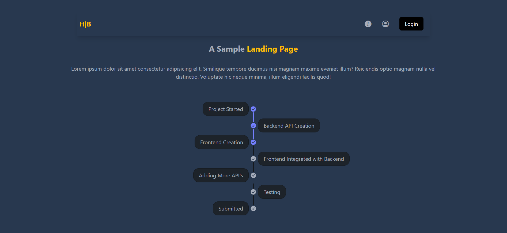
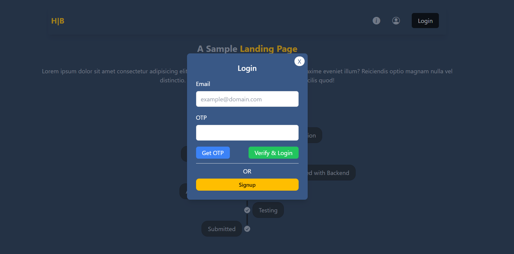
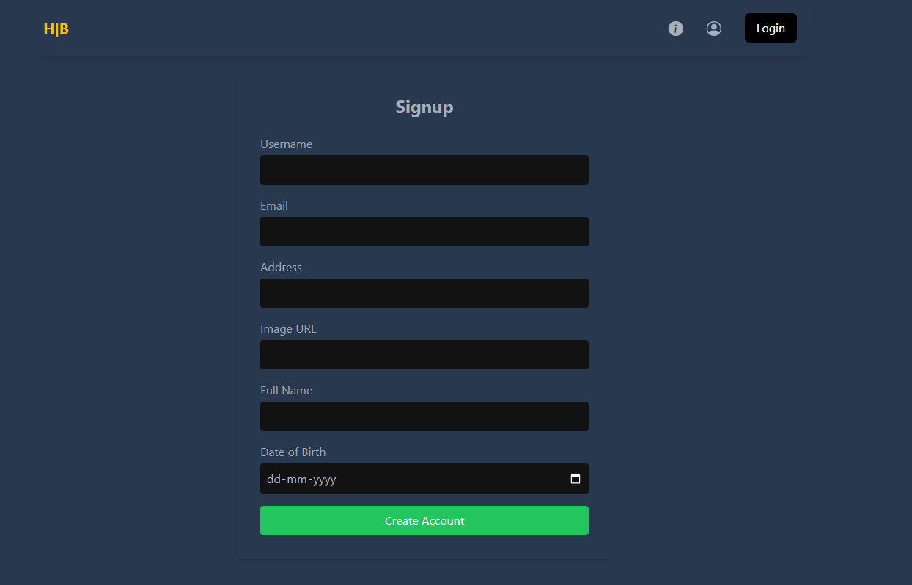
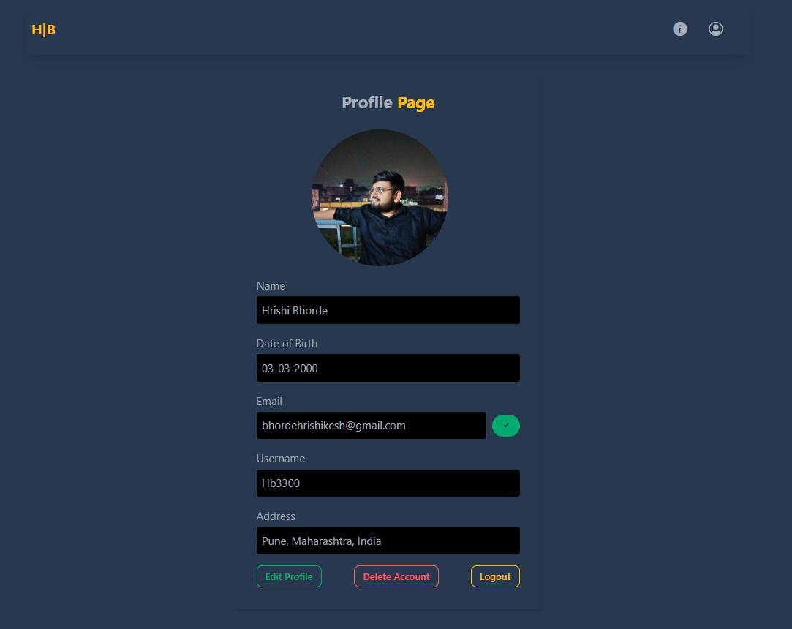
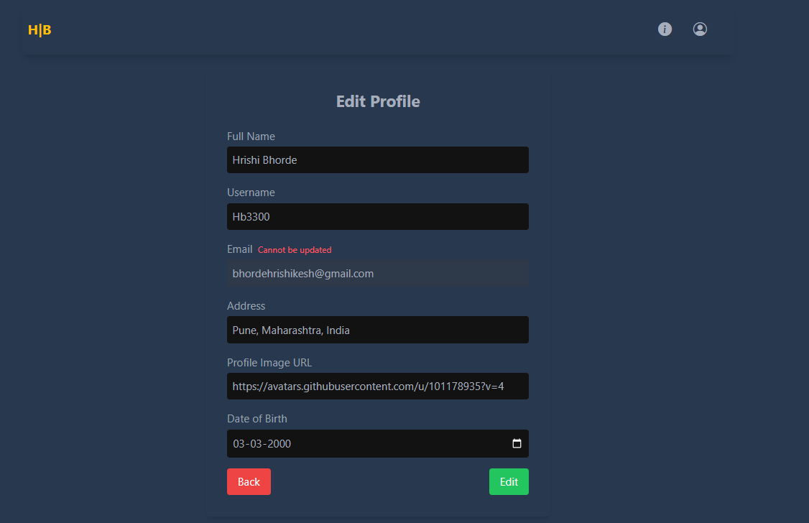
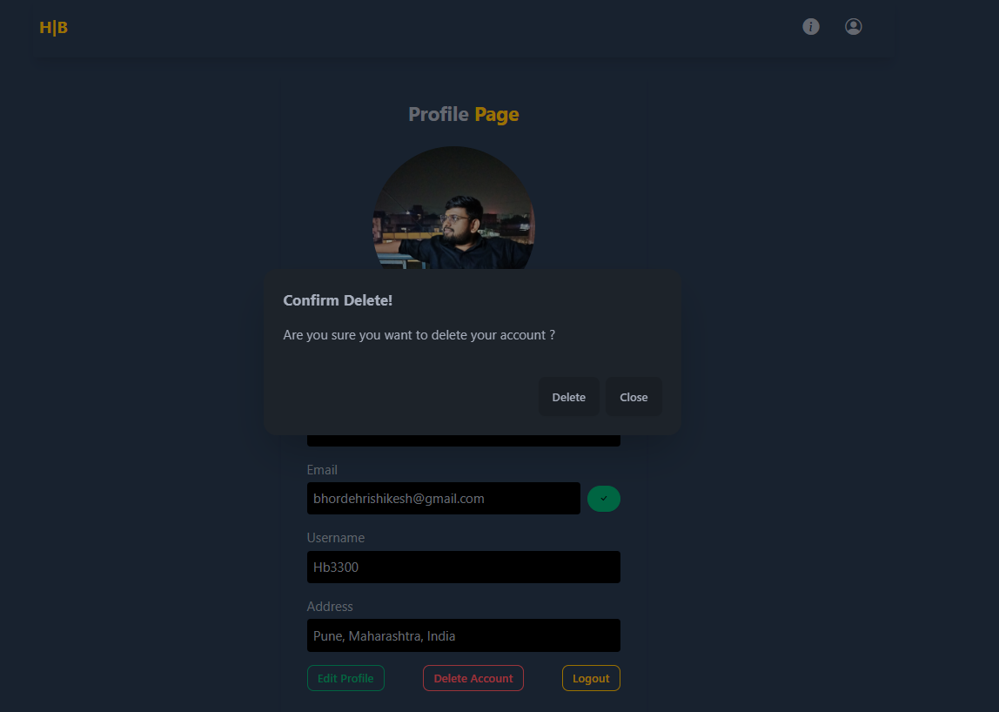
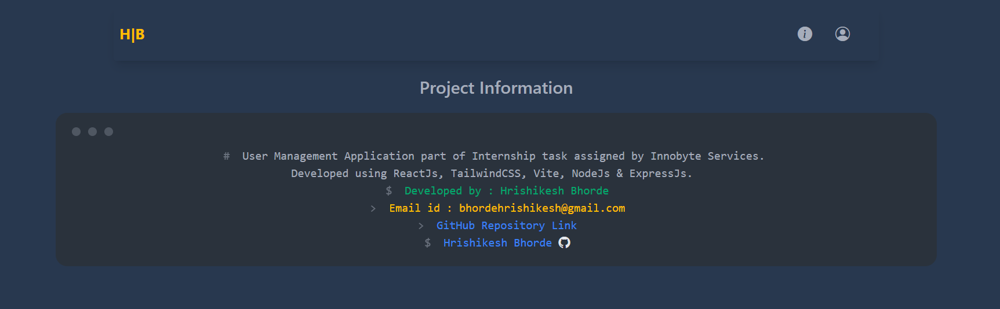

# UserManagementApp
 MERN Stack project to perfom all the CRUD operations on a user profile.

 # For Frontend

   1. cd frontend
   2. npm i
   3. npm run dev

 # For Backend 
   1. cd Backend
   2. npm i
   3. npm start  (Project will run on port 4001 or 4000)

